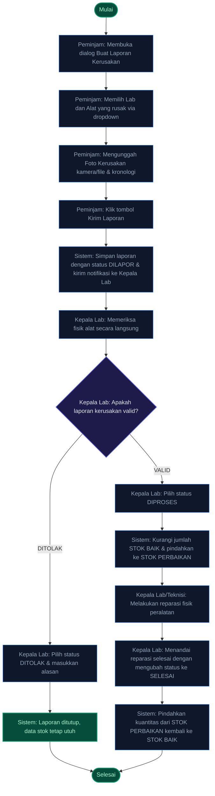

```mermaid
flowchart TD
    %% Nodes
    Start([Mulai]) --> F1[Peminjam: Memilih beberapa alat di Katalog & isi form Peminjaman]
    F1 --> F2[Sistem: Simpan pengajuan dengan status PENDING & kurangi Stok Sementara]
    F2 --> F3[Kepala Lab: Mengevaluasi permohonan peminjaman]
    
    F3 --> DEC1{Kepala Lab: Apakah pengajuan disetujui?}
    
    DEC1 -- DITOLAK --> F4_1[Kepala Lab: Masukkan catatan penolakan & klik Tolak]
    F4_1 --> F4_2[Sistem: Status DIASOSIASIKAN ke DITOLAK & kembalikan Stok Sementara] --> End([Selesai])
    
    DEC1 -- DISETUJUI --> F5_1[Kepala Lab: Klik Setujui]
    F5_1 --> F5_2[Sistem: Status berubah ke DISETUJUI & generate QR Code VERIFY_GRP]
    F5_2 --> F6[Peminjam: Mengunduh & mencetak Surat Peminjaman PDF berisi QR Code]
    F6 --> F7[Peminjam: Membawa surat fisik ke Lab untuk serah terima barang]
    
    F7 --> F8[Kepala Lab: Memindai QR Code Surat menggunakan Kamera Aktif / Upload File]
    F8 --> F9[Sistem: Verifikasi kode, redirect otomatis, & tampilkan detail transaksi]
    F9 --> F10[Kepala Lab: Menyerahkan barang fisik & klik tombol 'Barang DIAMBIL']
    
    F10 --> F11[Sistem: Status peminjaman diperbarui ke DIAMBIL]
    F11 --> F12[Peminjam: Menggunakan alat untuk praktikum/penelitian]
    
    F12 --> F13[Peminjam: Mengembalikan alat fisik dan membawa surat kembali ke Lab]
    F13 --> F14[Kepala Lab: Memindai kembali QR Code Surat Peminjaman]
    F14 --> F15[Kepala Lab: Memeriksa kelengkapan fisik alat & klik 'Sudah DIKEMBALIKAN']
    
    F15 --> F16[Sistem: Status peminjaman diperbarui ke DIKEMBALIKAN & Stok Asli ter-update]
    F16 --> End

    %% Styling
    classDef process fill:#0f172a,stroke:#3b82f6,stroke-width:1px,color:#94a3b8;
    classDef decision fill:#1e1b4b,stroke:#6366f1,stroke-width:1.5px,color:#e2e8f0;
    classDef finish fill:#064e3b,stroke:#059669,stroke-width:2px,color:#a7f3d0;
    
    class F1,F2,F3,F4_1,F4_2,F5_1,F5_2,F6,F7,F8,F9,F10,F11,F12,F13,F14,F15,F16 process;
    class DEC1 decision;
    class Start,End,F4_2 finish;
```

# Dokumentasi Alur Activity Diagram Utama
**ElectroLab-Inventory (Sistem Inventaris Laboratorium Teknik Elektro)**

Dokumen ini menyajikan panduan mendalam mengenai **Activity Diagram** untuk alur kerja (*business processes*) utama dan paling krusial pada sistem **ElectroLab-Inventory**. Penjelasan ini mencakup detail langkah, interaksi aktor, reaksi sistem, serta perubahan status data secara real-time.

---

## 1. Alur Peminjaman & Pengembalian Alat via QR Code (Core Sirkulasi)

Alur ini memodelkan seluruh siklus hidup sirkulasi peralatan, mulai dari pengajuan di katalog, persetujuan admin, pengambilan barang fisik menggunakan tanda tangan digital QR Code, hingga pengembalian barang.

### A. Diagram Alir Aktivitas


### B. Deskripsi Detail Alur Kerja
| No | Aktor Utama | Aksi Aktor | Reaksi Sistem | Perubahan Status Data |
| :--- | :--- | :--- | :--- | :--- |
| **1** | Peminjam | Memilih peralatan di katalog, memasukkan jumlah, tujuan, estimasi tanggal kembali, lalu klik **Ajukan Peminjaman**. | Memvalidasi ketersediaan stok fisik alat, mencatat pengajuan baru ke database. | `status: "PENDING"` |
| **2** | Kepala Lab | Membuka detail pengajuan pada daftar persetujuan, memeriksa kebutuhan praktikum peminjam. | Menampilkan profil peminjam (NIM/Email) serta status prioritas (misal: Dosen mendapatkan tanda khusus). | Tetap `PENDING` |
| **3** | Kepala Lab | Menentukan pilihan **Setujui** atau **Tolak** (disertai catatan penolakan jika ditolak). | Jika ditolak: memulihkan alokasi stok. Jika disetujui: mengunci stok sementara dan mencetak tanda tangan digital QR Code grup. | `status: "DISETUJUI"` atau `status: "DITOLAK"` |
| **4** | Peminjam | Mengunduh tanda bukti peminjaman berformat PDF yang memiliki QR Code dinamis tersemat di dalamnya. | Merender berkas PDF di sisi klien menggunakan format Kop Surat Resmi Politeknik Negeri Manado. | Tetap `DISETUJUI` |
| **5** | Kepala Lab | Memindai QR Code surat peminjaman yang dibawa peminjam menggunakan **Kamera Aktif** (atau unggah foto QR) pada **Dashboard**. | Mengenali tag enkripsi `VERIFY_GRP:<groupKey>`, memunculkan pemberitahuan sukses, melakukan *auto-redirect*, dan membuka dialog detail transaksi peminjaman. | Tetap `DISETUJUI` |
| **6** | Kepala Lab | Memeriksa fisik alat yang akan dibawa, lalu mengeklik tombol **Barang DIAMBIL**. | Mengunci data transaksi sirkulasi bahwa barang telah meninggalkan ruang penyimpanan laboratorium secara sah. | `status: "DIAMBIL"` |
| **7** | Kepala Lab | Menerima pengembalian alat fisik dari peminjam, memindai ulang QR Code surat, lalu klik **Sudah DIKEMBALIKAN**. | Memvalidasi data, memperbarui data stok inventaris utama (mengembalikan stok yang dipinjam ke unit siap pakai). | `status: "DIKEMBALIKAN"` |

> [!TIP]
> **Teknologi Scan QR Seamless:**
> Berkat pembaruan sistem pemindai (*custom headless scanner*), Kepala Lab tidak perlu masuk secara manual ke berbagai menu. Pemindaian QR Code tipe `VERIFY_GRP:` langsung dari Dashboard akan langsung mengarahkan navigasi router dan memicu pembukaan modal transaksi yang dituju secara otomatis.

---

## 2. Alur Pelaporan & Penanganan Kerusakan Alat (Maintenance)

Alur ini memodelkan bagaimana kerusakan fisik alat di lapangan ditangani secara administratif dan operasional oleh sistem untuk memastikan inventarisasi yang jujur dan akurat.

### A. Diagram Alir Aktivitas


### B. Deskripsi Detail Alur Kerja
1. **Identifikasi Awal**: Ketika Mahasiswa/Dosen mendapati alat laboratorium mengalami gangguan saat praktikum, mereka membuka formulir laporan kerusakan di sistem.
2. **Pengisian Laporan**: Pengguna memilih laboratorium terkait, mencari item alat dalam dropdown, lalu mengunggah foto bukti fisik menggunakan modul kamera HP atau berkas galeri. Laporan dikirim dengan status `DILAPOR`.
3. **Verifikasi Fisik**: Kepala Lab mengevaluasi kebenaran laporan. Jika laporan tidak valid (misal: kesalahan input atau laporan palsu), laporan ditolak (`status: "DITOLAK"`).
4. **Tahap Reparasi (`DIPROSES`)**: Jika valid, Kepala Lab mengubah status laporan ke `DIPROSES`. Sistem secara otomatis mengalokasikan stok item tersebut dengan memindahkan kuantitas dari **Stok Baik** ke **Stok Butuh Perbaikan**.
5. **Penyelesaian (`SELESAI`)**: Setelah alat selesai diperbaiki dan siap digunakan kembali, Kepala Lab mengeklik **Simpan Status SELESAI**. Kuantitas alat secara otomatis dikembalikan dari **Stok Butuh Perbaikan** ke **Stok Baik**, menjaga transparansi jumlah persediaan secara real-time.

> [!WARNING]
> **Unggah Foto Kerusakan:**
> Sistem mewajibkan lampiran foto bukti kerusakan nyata. Pembuat laporan dapat langsung mengaktifkan kamera depan/belakang (*user-facing/environment capture*) dari HP mereka atau memilih berkas gambar.

---

## 3. Alur Registrasi Akun Pengguna Baru (Gatekeeper Keamanan)

Sistem ini menerapkan gerbang keamanan (*security gatekeeper*) terverifikasi untuk mencegah pendaftaran ilegal atau akses data tanpa otorisasi.

### A. Diagram Alir Aktivitas
```mermaid
flowchart TD
    Start([Mulai]) --> U1[Calon User: Memasukkan Nama, Email, Password, NIM/NIP, & Role]
    U1 --> U2[Sistem: Validasi format email & keunikan NIM/NIP]
    
    U2 --> DEC3{Calon User: Memilih Role?}
    
    DEC3 -- DOSEN / MAHASISWA --> U3_1[Calon User: Memilih Asosiasi Laboratorium Utama]
    U3_1 --> U3_2[Sistem: Simpan akun sebagai PENDING & batasi hak akses login]
    U3_2 --> U4_1[Kepala Lab terkait: Menerima notifikasi registrasi tertunda]
    U4_1 --> U5_1[Kepala Lab: Klik 'Setujui Registrasi']
    
    DEC3 -- KEPALA LAB --> U3_3[Sistem: Simpan akun sebagai PENDING & kirim ke Kajur]
    U3_3 --> U4_2[Ketua Jurusan (Kajur): Menerima notifikasi di Dashboard Admin]
    U4_2 --> U5_2[Kajur: Klik 'Setujui Registrasi']
    
    U5_1 --> U6[Sistem: Aktifkan akun secara penuh, kirim notifikasi sukses, & buka hak login]
    U5_2 --> U6
    U6 --> End([Selesai])
    
    %% Styling
    classDef process fill:#0f172a,stroke:#3b82f6,stroke-width:1px,color:#94a3b8;
    classDef decision fill:#1e1b4b,stroke:#6366f1,stroke-width:1.5px,color:#e2e8f0;
    classDef finish fill:#064e3b,stroke:#059669,stroke-width:2px,color:#a7f3d0;
    
    class U1,U2,U3_1,U3_2,U3_3,U4_1,U4_2,U5_1,U5_2,U6 process;
    class DEC3 decision;
    class Start,End finish;
```

### B. Penjelasan Penting Alur Keamanan Akun
* **Penyaringan Bertingkat**: Akun **Mahasiswa** dan **Dosen** diverifikasi langsung oleh masing-masing **Kepala Laboratorium** tempat mereka terdaftar agar pengawasan aktivitas laboratorium lebih terlokalisasi.
* **Otoritas Tertinggi**: Pendaftaran akun **Kepala Laboratorium** baru harus diverifikasi dan disetujui langsung oleh **Ketua Jurusan (Kajur)** selaku pimpinan departemen tertinggi.
* **Proteksi Akses**: Sebelum akun disetujui (berstatus `PENDING`), pengguna sama sekali tidak dapat mengakses *Dashboard* dan hanya akan diarahkan ke halaman tunggu persetujuan jika mencoba memaksa masuk. Hal ini menjamin perlindungan data inventaris laboratorium dari manipulasi pihak luar.
