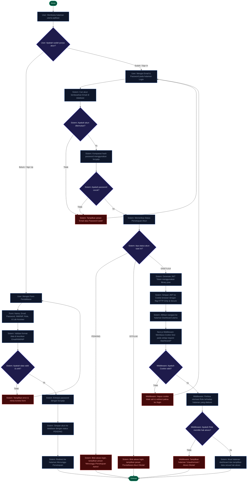

# Dokumentasi Alur Flowchart Autentikasi & Keamanan
**ElectroLab-Inventory (Sistem Inventaris Laboratorium Teknik Elektro)**

Dokumen ini menyajikan panduan teknis mendalam mengenai **Flowchart Autentikasi** serta gerbang keamanan (*security gatekeeper*) pada sistem **ElectroLab-Inventory**. Penjelasan ini mencakup alur pendaftaran (*Sign Up*), verifikasi status akun (*Pending Block*), proses masuk (*Sign In*), pembuatan sesi (*JWT jose*), hingga pelindung rute (*Next.js Middleware*).

---

## 1. Visualisasi Flowchart Autentikasi Lengkap

Sistem ini menggunakan alur autentikasi tersaring yang mencegah pengguna tidak terverifikasi mengakses data laboratorium secara ilegal.



---

## 2. Rincian Fase Autentikasi Penting & Utama

Flowchart di atas terbagi menjadi 3 fase krusial berikut ini:

---

### Fase A: Registrasi Tertunda (*Pending Sign-Up*)
Proses pembuatan akun baru di sistem yang tidak langsung aktif secara instan guna mencegah spammer dan mahasiswa dari luar jurusan.

| No | Tahap Aktivitas | Logika Bisnis & Keamanan | Perubahan Data di Database |
| :--- | :--- | :--- | :--- |
| **1** | Input Formulir | Calon pengguna mengisikan biodata, memilih role yang diinginkan (Mahasiswa, Dosen, Kepala Lab) serta asosiasi laboratorium utama mereka. | Belum ada perubahan. |
| **2** | Enkripsi Password | Sistem mengenkripsi kata sandi menggunakan pustaka `bcryptjs` dengan *salt rounds* standar industri sebelum disimpan untuk menjaga kerahasiaan kredensial. | Sandi diubah menjadi hash acak satu arah. |
| **3** | Pembuatan Akun Pasif | Akun disimpan di tabel database namun hak login ditangguhkan. Akun dikunci dalam kondisi *inactive/pending*. | Akun tersimpan dengan `status: "PENDING"`. |
| **4** | Gerbang Verifikasi | Sistem menampilkan layar pemberitahuan *"Registrasi Sukses, Menunggu Persetujuan Admin"* dan menolak proses login sebelum status diperbarui oleh Kepala Lab atau Kajur. | Tetap `PENDING`. |

---

### Fase B: Penyaringan Login (*Sign-In Filter & JWT Generation*)
Saringan utama saat pengguna mencoba masuk ke aplikasi menggunakan kredensial email dan password mereka.

```
[Input Kredensial] ──> [Verifikasi Hash Bcrypt] ──> [Cek Status Akun] ──> [Generate HTTP-Only JWT Cookie]
```

> [!CAUTION]
> **Pencegahan Login Status PENDING & DITOLAK:**
> Meskipun kombinasi Email dan Password yang diinputkan 100% cocok secara hash, sistem akan **menolak login** apabila kolom `status` di database masih berupa `PENDING` atau `DITOLAK`. Hal ini mencegah penyalahgunaan akun sebelum diverifikasi oleh administrator secara fisik.

* **Sesi JWT Jose yang Aman**:
  Setelah login dinyatakan lolos (Password benar & Status `DISETUJUI`), sistem akan menyandikan informasi dasar pengguna (ID, Nama, Email, Role, LabID) ke dalam token **JWT** menggunakan library `jose` (yang dioptimalkan untuk kinerja tinggi pada Next.js Edge Runtime).
  Token JWT disimpan di dalam **Cookie HTTP-Only & Secure**. Pilihan cookie HTTP-only memastikan token tidak dapat dibaca oleh script pihak ketiga di browser (mencegah serangan pencurian token melalui *Cross-Site Scripting* / XSS).

---

### Fase C: Pelindung Rute (*Middleware Route Guards & Role-based Access*)
Pelindung akses (*guard*) yang bertugas menyaring setiap pemanggilan rute halaman di bawah direktori `/dashboard/*`.

```
Setiap Request (/dashboard/*) 
       │
       ├──> [Baca Cookie Sesi] ───> Gagal/Kedaluwarsa ───> [Redirect ke /login]
       │
       └──> [Valid / Terbaca]
                 │
                 └──> [Cek Otorisasi Role Halaman]
                           │
                           ├──> Tidak Berhak ───> [Tampilkan Layar Unauthorized]
                           │
                           └──> Berhak ─────────> [Muat Halaman Dashboard & Data]
```

> [!IMPORTANT]
> **Cara Kerja Otorisasi Berbasis Peran (*Role-based Authorization*):**
> * **Ketua Jurusan (KAJUR)**: Memiliki otorisasi penuh lintas laboratorium (dapat melihat statistik semua lab, mengelola seluruh daftar pengguna, serta menyetujui akun Kepala Lab).
> * **Kepala Laboratorium (KEPALA_LAB)**: Hanya diotorisasi untuk mengelola data alat, laporan kerusakan, peminjaman, dan mahasiswa/dosen yang terdaftar di **laboratorium spesifik** milik mereka (`labId` yang cocok).
> * **Mahasiswa / Dosen (Peminjam)**: Hanya memiliki akses ke area peminjam (melihat katalog, memesan alat, melihat surat peminjaman pribadi, dan melaporkan kerusakan). Upaya mengakses menu administratif secara paksa melalui URL (misal: `/dashboard/users`) akan langsung dicegat oleh Middleware dan diblokir secara mutlak.

---

## 3. Matriks Keamanan & Token Sesi

| Lapisan Keamanan | Teknologi yang Digunakan | Target Pencegahan Ancaman |
| :--- | :--- | :--- |
| **Enkripsi Kredensial** | `bcryptjs` | Kebocoran kata sandi jika database terkompromi (penyerang tidak dapat membaca teks sandi asli). |
| **Penyimpanan Sesi** | JWT + Cookie `HTTP-Only` + `Secure` + `SameSite=Lax` | Mencegah serangan pencurian token (*XSS token theft*) dan eksploitasi sirkulasi (*CSRF protection*). |
| **Proteksi Halaman Backend** | Next.js `middleware.ts` (Edge Runtime) | Mencegah akses ke halaman administratif (bypass URL) oleh pengguna yang belum terautentikasi atau tidak berhak. |
| **Saringan Status Persetujuan** | Validasi Database (`status === "DISETUJUI"`) | Menjamin hak akses sistem hanya dimiliki oleh pengguna yang sudah disaring secara fisik oleh pengelola Lab/Jurusan. |
