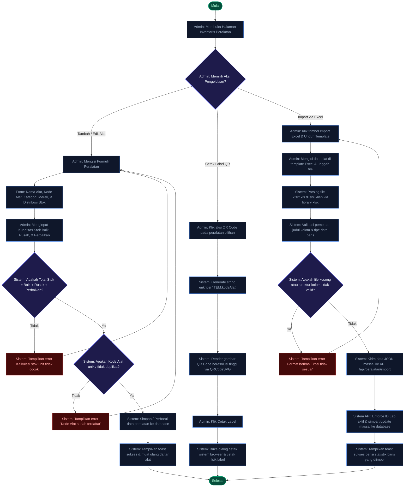

# Dokumentasi Alur Flowchart Pengelolaan Inventaris
**ElectroLab-Inventory (Sistem Inventaris Laboratorium Teknik Elektro)**

Dokumen ini menyajikan panduan operasional dan teknis mengenai **Flowchart Pengelolaan Inventaris** pada sistem **ElectroLab-Inventory**. Penjelasan ini mencakup alur penambahan/pembaruan peralatan (CRUD), pembuatan label QR Code peralatan otomatis, hingga alur impor data massal (*batch import*) via file Excel.

---

## 1. Visualisasi Flowchart Pengelolaan Inventaris Lengkap

Alur di bawah memodelkan bagaimana Kepala Laboratorium atau Ketua Jurusan mengelola aset peralatan secara presisi, baik secara satuan maupun massal.



---

## 2. Rincian Alur Pengelolaan Inventaris Penting & Utama

### A. Validasi Distribusi Stok (Matematika Inventaris)
Saat menambah atau mengubah (*edit*) data peralatan, sistem menerapkan aturan matematis ketat untuk menghindari ketidaksesuaian laporan fisik:

$$\text{Total Stok} = \text{Stok Baik} + \text{Stok Rusak} + \text{Stok Butuh Perbaikan}$$

> [!IMPORTANT]
> **Pencegahan Error Kalkulasi:**
> Jika administrator memasukkan angka kuantitas di mana penjumlahan ketiga kondisi unit tidak sama dengan kolom **Total**, sistem akan menolak penyimpanan dan menampilkan *toast* error. Hal ini memastikan integritas audit inventaris tahunan tetap terjaga dengan akurasi 100%.

---

### B. Alur Impor Batch Excel (Client-Side Parsing & API Import)
Fitur ini memfasilitasi migrasi data besar dari pembukuan manual (Excel) ke dalam database digital secara instan.

| Langkah Kerja | Pemrosesan Teknis (*Technical Process*) | Manfaat & Keamanan |
| :--- | :--- | :--- |
| **1. Unduh Template** | Menyediakan berkas `.xlsx` kosong yang sudah memiliki format kolom standar yang dikenali sistem. | Mencegah kesalahan ketik nama kolom oleh administrator. |
| **2. Parsing Klien** | File Excel dibaca langsung di browser menggunakan pustaka `xlsx`. Tidak ada pemrosesan file mentah di server (*Zero Server Upload Load*). | Menghindari beban memori berlebih pada server karena file diurai menjadi JSON di sisi klien terlebih dahulu. |
| **3. Validasi Kolom** | Sistem mencocokkan header kolom secara case-insensitive (misal: "JUMLAH TOTAL", "BAIK", "RUSAK", "BUTUH PERBAIKAN"). | Toleran terhadap variasi minor penulisan kolom Excel buatan admin. |
| **4. Injeksi API Lab** | Klien mengirimkan array JSON objek alat ke `/api/peralatan/import`. API secara otomatis mengunci `labId` berdasarkan user yang login. | Mencegah admin mengimpor data alat ke laboratorium milik admin lain secara sengaja maupun tidak sengaja. |

> [!TIP]
> **Skema Penguncian Kode Alat:**
> Selama pemrosesan API Impor massal, sistem akan mendeteksi jika `kodeAlat` sudah terdaftar di sistem. Jika sudah terdaftar, sistem akan melakukan **update** (sinkronisasi stok terbaru), dan jika belum, sistem akan melakukan **insert** baru (Upsert).

---

### C. Alur Pembuatan Label QR Code Peralatan
Setiap alat di dalam laboratorium diidentifikasi secara unik menggunakan label fisik QR Code berperekat.

```
[Klik Menu QR] ──> [Generate String "ITEM:KODE_ALAT"] ──> [Render SVG] ──> [Print Label Fisik]
```

* **Keunikan String**: QR Code dikodekan dengan format prefix `ITEM:<kodeAlat>` (contoh: `ITEM:EL-CT-001`). Format ini dibaca secara instan oleh pemindai kamera aktif di Dashboard untuk mengidentifikasi alat dengan cepat.
* **Cetak Vektor SVG**: Menggunakan `QRCodeSVG` dari React untuk menghasilkan gambar QR Code berbasis vektor. Keunggulannya adalah gambar label tidak akan pecah/blur saat dicetak dalam ukuran sekecil apa pun pada printer barcode/label termal.

---

## 3. Matriks Hak Akses Pengelolaan Inventaris

| Tindakan Pengelolaan | Kepala Laboratorium (Admin Lab) | Ketua Jurusan (Kajur) | Keterangan Otoritas |
| :--- | :---: | :---: | :--- |
| **Tambah / Edit Alat** | **Ya** (Khusus Lab-nya) | **Ya** (Semua Lab) | Mengisi data teknis dan kondisi persediaan. |
| **Hapus Alat** | **Ya** (Khusus Lab-nya) | **Ya** (Semua Lab) | Penghapusan permanen dari sistem. |
| **Impor via Excel** | **Ya** (Khusus Lab-nya) | Tidak | Hanya dikelola oleh Kepala Lab masing-masing untuk akurasi audit fisik. |
| **Cetak Label QR Code** | **Ya** (Khusus Lab-nya) | **Ya** (Semua Lab) | Digunakan untuk melabeli fisik alat laboratorium. |
