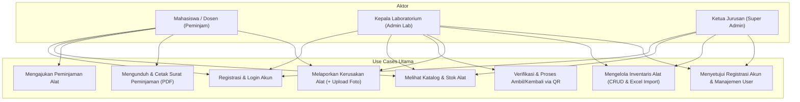
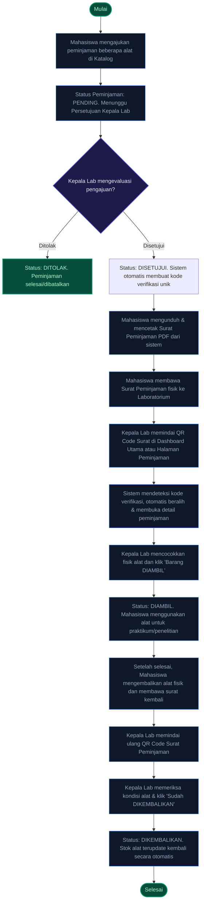
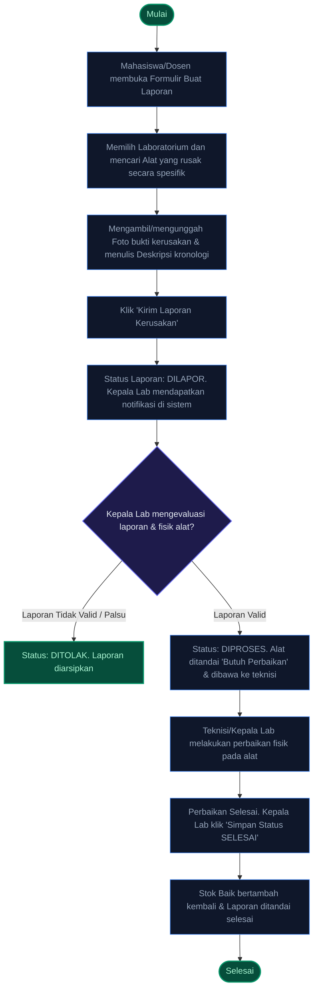

# Dokumentasi Alur Use Case & Activity Diagram
**ElectroLab-Inventory (Sistem Inventaris Laboratorium Teknik Elektro)**

Dokumen ini menjelaskan alur **Use Case Diagram** serta visualisasi **Activity Diagram** untuk proses bisnis utama yang berjalan pada sistem **ElectroLab-Inventory**. Penjelasan difokuskan pada alur yang paling penting, krusial, dan mewakili fitur unggulan aplikasi ini (seperti integrasi QR Code).

---

## 1. Pemetaan Use Case Diagram

Sistem ini melibatkan 3 aktor utama dengan wewenang yang terstruktur secara hierarkis:
1. **Mahasiswa / Dosen (Peminjam)**
2. **Kepala Laboratorium (Admin Lab)**
3. **Ketua Jurusan (Kajur - Super Admin)**

### Visualisasi Use Case Diagram

---

## 2. Activity Diagram Utama & Paling Penting

Berikut adalah rincian alur aktivitas (*Activity Diagram*) untuk dua fitur paling vital dalam aplikasi ini:

---

### A. Alur Peminjaman Alat & Verifikasi QR Code (Core Workflow)
Ini adalah alur terpenting di mana **Mahasiswa/Dosen**, **Surat Peminjaman Fisik (dengan Digital Signature QR)**, dan **Kepala Laboratorium** saling berinteraksi secara aman melalui pemindaian QR Code.

> [!IMPORTANT]
> **Integrasi QR Code `VERIFY_GRP:`**
> Pemindaian QR Code dari surat cetak berfungsi sebagai tanda tangan digital (*Digital Signature*). Pemindaian ini dapat dilakukan langsung pada **Dashboard Utama** melalui tombol *Scan QR Alat*, yang akan secara otomatis mengenali dokumen dan mengalihkan Kepala Lab secara instan ke portal persetujuan peminjaman yang tepat.

---

### B. Alur Pelaporan Kerusakan Alat (Maintenance Workflow)
Alur ini memfasilitasi pelaporan kerusakan secara cepat dari pengguna langsung di lapangan sehingga kondisi inventaris tetap akurat dan terpantau secara real-time.

> [!TIP]
> **Otomatisasi Stok pada Laporan Kerusakan:**
> * Saat status laporan diperbarui ke **DIPROSES**, sistem secara otomatis memindahkan kuantitas alat dari *Stok Baik* ke *Stok Butuh Perbaikan*.
> * Saat status diselesaikan ke **SELESAI**, kuantitas alat akan dialihkan kembali dari *Stok Butuh Perbaikan* ke *Stok Baik*, menjaga sinkronisasi data inventaris secara instan tanpa input manual ganda.

---

## 3. Rangkuman Kontribusi Aktor Terhadap Data Inventaris

| Aktor | Peran Utama Terhadap Sistem | Dampak Alur Kerja (*Business Impact*) |
| :--- | :--- | :--- |
| **Mahasiswa / Dosen** | Pengguna akhir (*End-User*) yang melakukan transaksi peminjaman dan membuat laporan kerusakan alat. | Menjadi sumber data aktivitas utama (permintaan stok keluar dan laporan kerusakan lapangan). |
| **Kepala Laboratorium** | Pengelola operasional laboratorium (*Operator/Admin*), verifikator keabsahan dokumen, dan pengelola aset fisik. | Mengendalikan arus fisik barang, menyetujui sirkulasi alat, dan menjaga akurasi data stok melalui CRUD/Import Excel. |
| **Ketua Jurusan** | Pengawas departemen (*Supervisor/Super-admin*) yang melihat statistik performa seluruh lab untuk pengambilan keputusan. | Menerima data agregat sirkulasi alat untuk analisis kebutuhan anggaran pengadaan alat baru di masa depan. |
