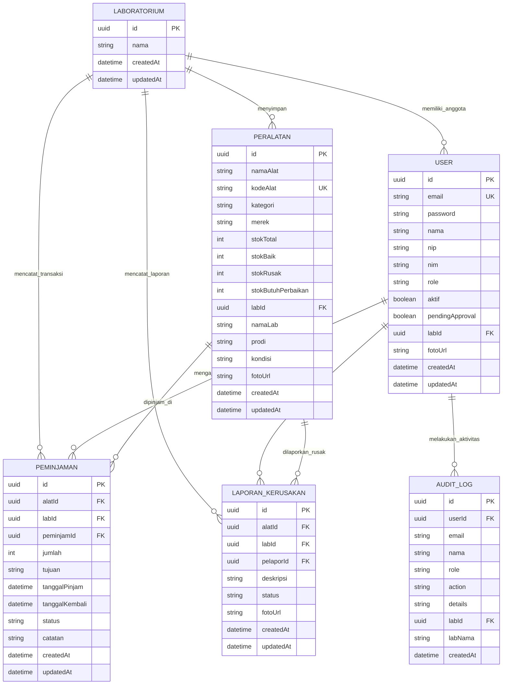

# Dokumentasi Entity Relationship Diagram (ERD) & Struktur Database
**ElectroLab-Inventory (Sistem Inventaris Laboratorium Teknik Elektro)**

Dokumen ini menyajikan pemetaan relasional data mendalam mengenai **Entity Relationship Diagram (ERD)** serta skema database fisik yang digunakan oleh sistem **ElectroLab-Inventory**. Database ini diimplementasikan menggunakan **Supabase PostgreSQL** dengan integritas referensial yang kuat.

---

## 1. Visualisasi Entity Relationship Diagram (ERD)

Berikut adalah visualisasi hubungan antarentitas dalam sistem menggunakan diagram relasi entitas Mermaid:

---

## 2. Rincian Kamus Data Entitas (Schema Dictionary)

---

### A. Tabel: `User`
Menyimpan data kredensial, hak akses (peran), dan status persetujuan dari seluruh pengguna sistem.

| Nama Kolom | Tipe Data | Constraint | Keterangan |
| :--- | :--- | :--- | :--- |
| `id` | `uuid` | **PRIMARY KEY**, Default: uuid_generate_v4() | ID unik untuk setiap pengguna. |
| `email` | `varchar` | **UNIQUE**, **NOT NULL** | Alamat email unik untuk login. |
| `password` | `varchar` | **NOT NULL** | Hash kata sandi terenkripsi (bcryptjs). |
| `nama` | `varchar` | **NOT NULL** | Nama lengkap pengguna. |
| `nip` | `varchar` | **NULL** | Nomor Induk Pegawai (wajib diisi jika Dosen/Kepala Lab). |
| `nim` | `varchar` | **NULL** | Nomor Induk Mahasiswa (wajib diisi jika Mahasiswa). |
| `role` | `enum` | **NOT NULL** | Hak akses akun: `'MAHASISWA'`, `'DOSEN'`, `'KEPALA_LAB'`, `'KAJUR'`. |
| `aktif` | `boolean` | Default: `false` | Menandakan apakah akun aktif / disetujui. |
| `pendingApproval` | `boolean` | Default: `true` | Menandakan akun sedang mengantre persetujuan. |
| `labId` | `uuid` | **FOREIGN KEY** $\rightarrow$ `Laboratorium(id)`, **NULL** | Laboratorium tempat Kepala Lab bertugas atau Peminjam berafiliasi (NULL untuk KAJUR). |
| `fotoUrl` | `text` | **NULL** | URL foto profil pengguna di storage. |
| `createdAt` | `timestamptz`| Default: `now()` | Waktu pembuatan akun pertama kali. |
| `updatedAt` | `timestamptz`| Default: `now()` | Waktu pembaruan informasi akun terakhir kali. |

---

### B. Tabel: `Laboratorium`
Menyimpan data nama-nama laboratorium Teknik Elektro Politeknik Negeri Manado.

| Nama Kolom | Tipe Data | Constraint | Keterangan |
| :--- | :--- | :--- | :--- |
| `id` | `uuid` | **PRIMARY KEY** | ID unik laboratorium. |
| `nama` | `varchar` | **NOT NULL** | Nama resmi laboratorium (contoh: *Lab Jaringan Komputer*). |
| `createdAt` | `timestamptz`| Default: `now()` | Waktu pembuatan entitas. |

---

### C. Tabel: `Peralatan`
Menyimpan data inventaris alat dan rincian pembagian kondisi stok pada masing-masing laboratorium.

| Nama Kolom | Tipe Data | Constraint | Keterangan |
| :--- | :--- | :--- | :--- |
| `id` | `uuid` | **PRIMARY KEY** | ID unik item peralatan. |
| `namaAlat` | `varchar` | **NOT NULL** | Nama barang inventaris. |
| `kodeAlat` | `varchar` | **UNIQUE**, **NOT NULL** | Barcode/SKU alat (contoh: `EL-CT-001`). Digunakan untuk QR Code. |
| `kategori` | `varchar` | **NOT NULL** | Kategori alat (contoh: *Sensor*, *Alat Ukur*). |
| `merek` | `varchar` | **NULL** | Spesifikasi / Merek barang. |
| `stokTotal` | `integer` | **NOT NULL**, Default: `0` | Total stok terdaftar (harus sama dengan penjumlahan stok kondisi). |
| `stokBaik` | `integer` | **NOT NULL**, Default: `0` | Jumlah unit dalam kondisi baik (siap dipinjam). |
| `stokRusak` | `integer` | **NOT NULL**, Default: `0` | Jumlah unit dalam kondisi rusak parah (tidak bisa dipakai). |
| `stokButuhPerbaikan`| `integer` | **NOT NULL**, Default: `0` | Jumlah unit sedang dalam tahap perbaikan fisik. |
| `labId` | `uuid` | **FOREIGN KEY** $\rightarrow$ `Laboratorium(id)` | Lokasi penyimpanan unit laboratorium. |
| `namaLab` | `varchar` | **NULL** | Nama Lab (data redundan yang dicache untuk efisiensi kueri). |
| `prodi` | `varchar` | **NULL** | Program studi terkait alat tersebut. |
| `fotoUrl` | `text` | **NULL** | URL gambar alat di storage. |

---

### D. Tabel: `Peminjaman`
Menyimpan data log transaksi peminjaman alat secara berkelompok/individu.

| Nama Kolom | Tipe Data | Constraint | Keterangan |
| :--- | :--- | :--- | :--- |
| `id` | `uuid` | **PRIMARY KEY** | ID unik transaksi peminjaman. |
| `alatId` | `uuid` | **FOREIGN KEY** $\rightarrow$ `Peralatan(id)` | ID alat yang dipinjam. |
| `labId` | `uuid` | **FOREIGN KEY** $\rightarrow$ `Laboratorium(id)` | Lokasi laboratorium tempat alat dipinjam. |
| `peminjamId` | `uuid` | **FOREIGN KEY** $\rightarrow$ `User(id)` | ID peminjam (Mahasiswa / Dosen). |
| `jumlah` | `integer` | **NOT NULL** | Kuantitas unit alat yang dipinjam. |
| `tujuan` | `text` | **NOT NULL** | Keperluan peminjaman (contoh: *Praktikum Jaringan*). |
| `tanggalPinjam` | `date` | **NOT NULL** | Tanggal pengambilan barang. |
| `tanggalKembali` | `date` | **NULL** | Tanggal estimasi pengembalian barang. |
| `status` | `enum` | Default: `'PENDING'` | Status alur: `'PENDING'`, `'DISETUJUI'`, `'DITOLAK'`, `'DIAMBIL'`, `'DIKEMBALIKAN'`. |
| `catatan` | `text` | **NULL** | Catatan tambahan dari Kepala Lab saat verifikasi status. |

---

### E. Tabel: `LaporanKerusakan`
Menyimpan log aduan kerusakan peralatan laboratorium yang dilaporkan oleh pengguna.

| Nama Kolom | Tipe Data | Constraint | Keterangan |
| :--- | :--- | :--- | :--- |
| `id` | `uuid` | **PRIMARY KEY** | ID unik laporan kerusakan. |
| `alatId` | `uuid` | **FOREIGN KEY** $\rightarrow$ `Peralatan(id)` | ID alat yang dilaporkan rusak. |
| `labId` | `uuid` | **FOREIGN KEY** $\rightarrow$ `Laboratorium(id)` | ID lab lokasi alat tersebut berada. |
| `pelaporId` | `uuid` | **FOREIGN KEY** $\rightarrow$ `User(id)` | ID pengguna yang melaporkan kerusakan. |
| `deskripsi` | `text` | **NOT NULL** | Kronologi/deskripsi detail kerusakan. |
| `status` | `enum` | Default: `'DILAPOR'` | Alur laporan: `'DILAPOR'`, `'DIPROSES'`, `'SELESAI'`, `'DITOLAK'`. |
| `fotoUrl` | `text` | **NULL** | Tautan bukti foto fisik kerusakan. |

---

### F. Tabel: `AuditLog`
Menyimpan log audit aktivitas administratif untuk kebutuhan pelacakan aksi sensitif (security logging).

| Nama Kolom | Tipe Data | Constraint | Keterangan |
| :--- | :--- | :--- | :--- |
| `id` | `uuid` | **PRIMARY KEY** | ID unik log audit. |
| `userId` | `uuid` | **FOREIGN KEY** $\rightarrow$ `User(id)` | ID pelaku aktivitas. |
| `email` | `varchar` | **NOT NULL** | Email pelaku. |
| `nama` | `varchar` | **NOT NULL** | Nama lengkap pelaku. |
| `role` | `varchar` | **NOT NULL** | Peran/role pelaku. |
| `action` | `varchar` | **NOT NULL** | Deskripsi singkat aksi (contoh: *Import Peralatan Excel*). |
| `details` | `text` | **NULL** | Rincian detail dari log audit. |
| `labId` | `uuid` | **NULL** | Lab terkait tempat aksi dilakukan. |
| `createdAt` | `timestamptz`| Default: `now()` | Waktu terjadinya aktivitas. |

---

## 3. Penjelasan Relasi & Integritas Referensial

### 1. Hubungan Aktor ke Laboratorium (Satu-ke-Banyak)
* **Relasi**: Satu `Laboratorium` memiliki banyak `User` (Mahasiswa, Dosen, Kepala Lab) $\rightarrow$ **1:N**.
* **Keamanan**: Kolom `labId` pada tabel `User` mengunci ruang lingkup otorisasi Kepala Lab agar hanya bisa mengakses data di bawah kueri laboratoriumnya sendiri. RLS (*Row Level Security*) pada PostgreSQL memanfaatkan relasi ini.

### 2. Hubungan Sirkulasi Peminjaman (Banyak-ke-Banyak melalui Transaksi)
* **Relasi**: `User` meminjam banyak `Peralatan` melalui tabel penengah `Peminjaman`.
* **Integritas**: Penghapusan data peralatan (`Peralatan`) akan dibatasi (*RESTRICT*) jika alat tersebut sedang aktif dipinjam dalam tabel `Peminjaman` guna menghindari hilangnya riwayat pertanggungjawaban fisik.

### 3. Hubungan Audit Log Mandiri
* **Relasi**: Setiap aktivitas administratif terhubung ke `User` via `userId`.
* **Integritas**: Data `AuditLog` dibuat bersifat *append-only* (hanya bisa ditambah, tidak bisa di-update atau didelete) untuk menjamin keabsahan log forensik keamanan sistem.

> [!WARNING]
> **Cascading Triggers:**
> Penghapusan baris pada tabel induk `Laboratorium` diatur dengan constraint `ON DELETE RESTRICT`. Hal ini mencegah terhapusnya suatu laboratorium jika di dalamnya masih menyimpan aset peralatan (`Peralatan`) atau pengguna (`User`) aktif, menjaga database dari kerusakan struktural data tak disengaja.
